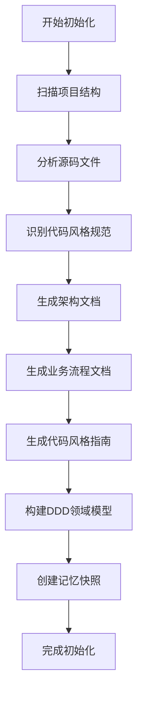
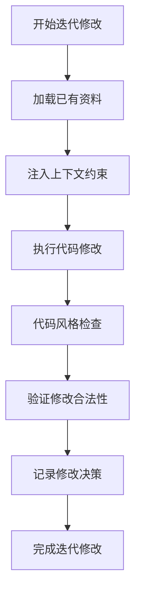
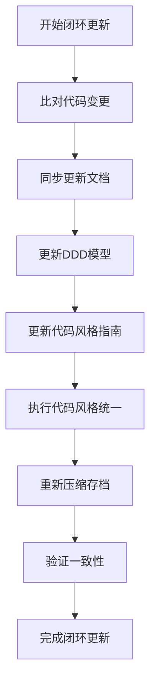

# 业务流程文档

## 核心业务流程

### 1. 初始化流程

### 2. 迭代修改流程

### 3. 闭环更新流程

## 业务场景

### 场景1：新项目初始化

1. **触发条件**：首次使用 MemDDC-Pro 技能
2. **执行流程**：
   - 扫描项目目录结构
   - 生成完整工程文档
   - 构建DDD领域模型
   - 创建记忆快照
3. **输出结果**：
   - `docs/` 目录下的全套文档
   - `ddd-model.md` 领域模型文件
   - `mem-snapshot.json` 记忆快照文件

### 场景2：代码修改

1. **触发条件**：用户执行代码修改
2. **执行流程**：
   - 加载已有资料
   - 注入上下文约束
   - 执行代码修改
   - 代码风格检查
3. **输出结果**：
   - 修改后的代码文件
   - 代码风格统一

### 场景3：架构迭代

1. **触发条件**：用户进行架构调整
2. **执行流程**：
   - 加载已有资料
   - 注入上下文约束
   - 执行架构调整
   - 同步更新文档
   - 重新压缩存档
3. **输出结果**：
   - 更新后的架构文档
   - 更新后的DDD模型
   - 更新后的记忆快照

### 场景4：代码风格统一

1. **触发条件**：用户需要统一代码风格
2. **执行流程**：
   - 加载代码风格规范
   - 执行代码风格检查
   - 自动修复代码风格问题
   - 验证代码风格一致性
3. **输出结果**：
   - 代码风格统一的代码文件
   - 更新后的代码风格指南

## 业务规则

1. **初始化规则**：
   - 首次使用时自动触发
   - 生成完整的工程文档和模型
   - 创建初始记忆快照

2. **迭代规则**：
   - 每次修改代码时必须调用
   - 严格遵循历史架构决策
   - 遵守代码风格规范

3. **闭环规则**：
   - 修改完成后必须执行
   - 同步更新所有关联文档
   - 重新压缩存档

4. **一致性规则**：
   - 保证代码、文档、DDD、记忆压缩四者强一致
   - 验证所有资料永远最新
   - 确保代码风格统一

## 性能指标

1. **初始化时间**：
   - 小型项目：< 1分钟
   - 中型项目：< 5分钟
   - 大型项目：< 15分钟

2. **迭代响应时间**：
   - 代码修改：< 30秒
   - 文档更新：< 1分钟
   - 记忆快照更新：< 30秒

3. **存储空间**：
   - 文档压缩率：> 50%
   - 记忆快照压缩率：> 70%

4. **准确率**：
   - 代码风格识别准确率：> 95%
   - DDD模型构建准确率：> 90%
   - 文档生成准确率：> 95%

## 异常处理

1. **初始化失败**：
   - 原因：项目目录权限不足、源码文件不足
   - 处理：检查权限、确保项目包含足够的源码文件

2. **记忆加载失败**：
   - 原因：记忆快照文件不存在、格式错误
   - 处理：检查文件存在性、验证格式、重新初始化

3. **文档更新失败**：
   - 原因：文档目录权限不足、磁盘空间不足
   - 处理：检查权限、确保磁盘空间充足

4. **代码风格检查失败**：
   - 原因：代码风格配置错误、检查器权限不足
   - 处理：检查配置、确保检查器有执行权限